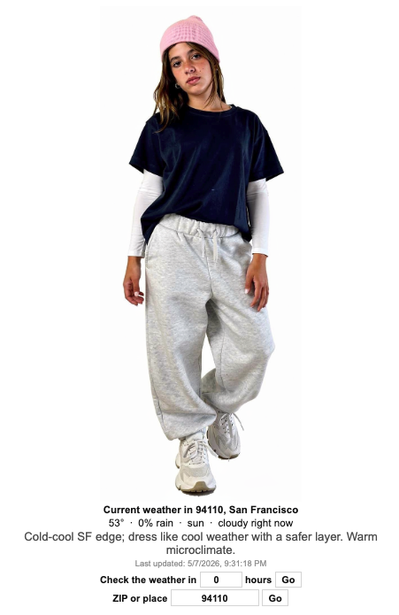
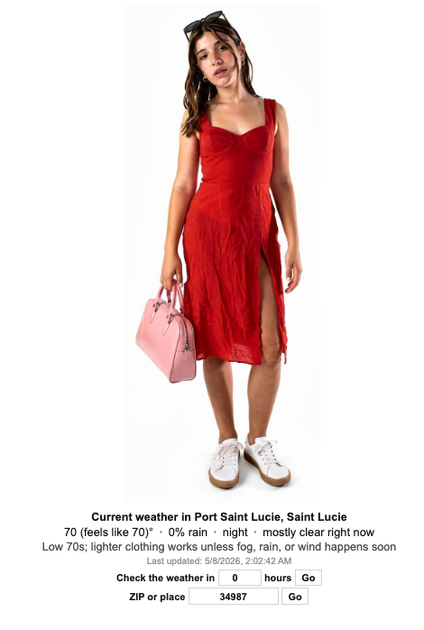

# 🌈 Comfyday

**[TRY IT ON HERE](https://comfyday.vercel.app/)**

###   💜💛💙💚❤️      For Saoirse       💜💛💙💚❤️

> **A tiny weather-to-outfit app for “what do I wear right now?” days**


Comfyday checks the weather for a 5-digit ZIP code, interprets the weather, maps it to a pre-generated FLUX outfit image, and renders one fixed model responsively. Only 5-digit ZIP input is supported in the shipped app.

## ✨ What It Does

| Feature                        | Why It Matters                                                           |
| ------------------------------ | ------------------------------------------------------------------------ |
| 🌦️ Weather-aware outfits        | Uses current/forecast weather instead of a fixed outfit.                 |
| 📍 ZIP code input               | Enter a 5-digit ZIP and check weather up to 24 hours ahead.              |
| 🌍 Country-aware ZIP tie-breaks | Ambiguous postal codes can prefer the request country from deployment headers. |
| 🧊 Tight SF-style temp buckets  | Most logic is tuned around the common `50s-70s°F` range.                 |
| 💨 Provider-based wind/fog/rain | No fake weather guesses; provider data drives outfit changes.            |
| 🖼️ Static generated looks       | Runtime is fast because it only selects pre-rendered images.             |
| 📱 Responsive frontend          | Built to fit the model + text on desktop and mobile.                     |

## 📸 Screenshots

<p align="center">
  
  
</p>

This public repo excludes the full private generated outfit library. These screenshots show the product experience with static weather-matched outfit renders.

## 🧃 Recreate This Website And Show Off Your Outfits
_**or stop reminding your kid to wear a jacket**_

1. Open Terminal.
2. Get the code:
```bash
git clone https://github.com/YOUR_USERNAME/comfyday.git
cd comfyday
```
3. Install the app:
`uv sync`
4. Get weather API keys:
- Make a Tomorrow.io account and copy an API key.
- Optional fallback: make a Weatherstack account and copy an API key.
5. Create `.env` file in codebase:
```bash
TOMORROW_API_KEY=your_key_here
WEATHERSTACK_API_KEY=your_optional_key_here
WEATHER_QUERY=94110
```
6. Run it:
`uv run fastapi dev main.py`
7. Open: `http://localhost:8000`
8. Optional image generation:
- Go to [Replicate FLUX.2 Pro](https://replicate.com/black-forest-labs/flux-2-pro).
- Create a Replicate API key
- Add `COMFY_REPLICATE_API_KEY=...` to your new file `.env` in your codebase
- Run `uv run --group generate python scripts/run_replicate.py`.

## 🚫 What This Public Demo Excludes

The real deployment uses private generated images in:

```text
static/generated/flux2/
```

Those files are excluded here because they are private personal images. This public repo is for reviewing the app structure, weather logic, tests, and deployment shape.

## 🛠️ Run Locally

```bash
uv sync
uv run fastapi dev main.py
```

Open:

```text
http://localhost:8000
```

Create a local `.env`:

```bash
TOMORROW_API_KEY=...
WEATHERSTACK_API_KEY=...
```

## 🧠 Architecture

| Layer                  | Files                                | Job                                                                 |
| ---------------------- | ------------------------------------ | ------------------------------------------------------------------- |
| Backend                | `main.py`                            | FastAPI routes, Jinja shell, static file serving                    |
| Weather                | `weather_service.py`                 | Tomorrow.io first, Weatherstack fallback, ZIP geocoding, cache fallback |
| Provider normalization | `weather_api.py`                     | Tomorrow.io / Weatherstack → one `WeatherSnapshot`                  |
| Outfit selection       | `outfit_logic.py`                    | Temp bucket + rain/fog/wind → preset key                            |
| Scene payload          | `scene_builder.py`                   | One static image URL + compact weather text                         |
| Browser UI             | `static/app.js`, `static/styles.css` | Fetch scene JSON and render responsively                            |
| Generation ops         | `scripts/run_replicate.py`           | Optional offline reruns for bad FLUX outputs                        |

```text
main.py
  FastAPI routes + static frontend

weather_service.py
  ZIP validation, postcode geocoding, provider selection, caching

weather_api.py
  Tomorrow.io / Weatherstack normalization

outfit_logic.py
  weather → preset key

scene_builder.py
  final scene payload for the browser

static/app.js + static/styles.css
  tiny frontend renderer
```

## 🔁 Runtime Flow

```text
ZIP code + hours ahead
  -> weather_service.py
  -> weather_api.py provider normalization
  -> outfit_logic.py preset selection
  -> scene_builder.py one-image scene
  -> frontend renders /static/generated/flux2/<preset>.png
```

The live app does **not** run image generation, virtual try-on, or clothing compositing at request time.

## 🌦️ Weather Inputs

| Signal                              | Used For                                    |
| ----------------------------------- | ------------------------------------------- |
| `temperature`                       | display temperature                         |
| `temperatureApparent` / feels-like  | outfit bucket selection                     |
| precipitation intensity/probability | wet vs dry outfit routing                   |
| weather code + description          | fog, cloud, rain, snow labels               |
| wind speed/gust                     | breezy/windy labels + wind-specific outfits |
| local forecast hour                 | “right now” vs “N hours from now” display   |
| request-country header              | breaks postal-code ties like `10115` US vs DE |

## 🌁 SF Outfit Logic

San Francisco usually lives in the `52-72°F` band, with `63°F` as the classic “bring a layer” center. Comfyday uses provider truth first, then chooses a generated outfit:

1. Blend real temp and feels-like temp.
2. Adjust for real provider signals: sun, clouds, fog, rain, and wind.
3. Pick a dry outfit from temp buckets that are tightest around `62-64°F`.
4. If rain/snow/active precip is present, route to a wet-safe outfit by temp.

The app does not invent fake fog, wind, or rain from vibes. If the provider does not report it, it does not force that condition.

## 🧪 Tests

```bash
uv sync --group dev
PYTHONPATH=. uv run pytest -q
```

Private-repo tests cover:

- API payload contracts
- provider normalization
- no-network weather edge cases
- fixture-backed integration replays for SF and Mexico City
- preset reachability
- generated-image coverage
- FLUX rerun-script safety

Record live integration fixtures once:

```bash
COMFY_RECORD_INTEGRATION=1 PYTHONPATH=. uv run pytest -q tests/test_integration_weather.py -s
```

After that, the same integration tests replay from `tests/fixtures/integration/` without live network calls.

Note: image-coverage tests expect private generated images. For the public repo, either add safe placeholder images or skip those private-asset checks.

## 🚀 Deploy Notes

Production needs weather provider secrets:

```bash
TOMORROW_API_KEY=...
WEATHERSTACK_API_KEY=...
```

The Replicate key is only for offline image generation and should not be needed by the runtime app.

Local-only optional defaults:

```bash
WEATHER_QUERY=94110
COMFY_REPLICATE_API_KEY=...
```

## 🎨 Regenerating Outfit Images

The private workflow uses **Replicate** with [**Black Forest Labs FLUX.2 Pro**](https://replicate.com/black-forest-labs/flux-2-pro) to regenerate static outfit images:

```bash
uv sync --group generate
uv run --group generate python scripts/run_replicate.py
```

Generation script:

```text
scripts/run_replicate.py
  -> model: black-forest-labs/flux-2-pro
  -> input: base model image + outfit/accessory reference images
  -> output: one finished static outfit render
```

Runtime does **not** call Replicate or FLUX. The app only serves already-generated static outfit renders.

Generation env var, private/offline only:

```bash
COMFY_REPLICATE_API_KEY=...
```

Why this model/path:

- Strong image-edit quality for full-body fashion renders.
- Accepts multiple reference images: base model plus clothing/accessory assets.
- Good enough identity/style preservation for a small static catalog.
- Fast to iterate through Replicate without running a local GPU worker.
- Keeps production simple: the deployed app serves static PNGs and never calls the model at runtime.

## 💅 Why Static Images?

Early versions tried runtime clothing overlays. That was brittle: scale, pose, hands, hair, and occlusion made outfits look fake. The current version pre-generates complete outfits and lets the app pick the right render for the weather.

```text
less magic at runtime
more reliable outfit results
faster page loads
```
